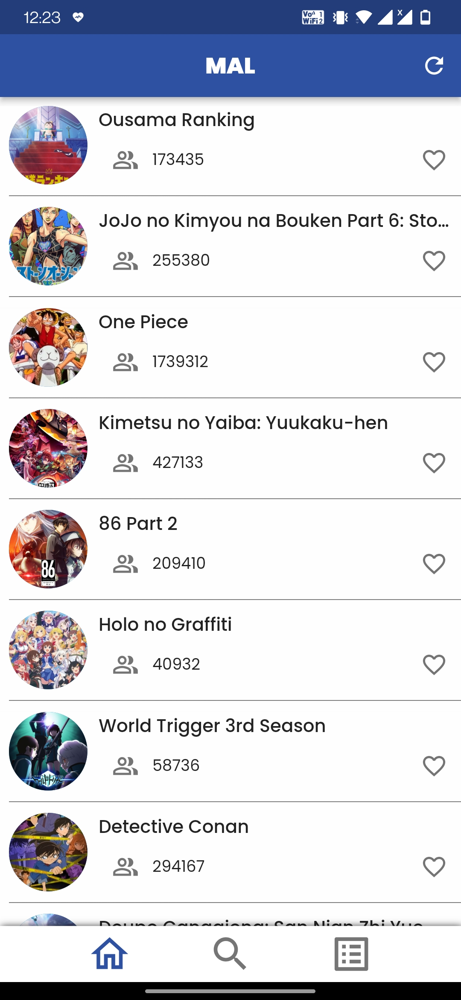

# MyAnimeList-Clone

> Clone of popular MyAnimeList App.

## Table of Contents

-   [How To Use](#how-to-use)
-   [Contributing](#contributing)
-   [License](#license)

Home                      |  Search
:------------------------:|:-------------------------:
  |  

Search Result                      |  Anime Details
:---------------------------------:|:----------------------------:
  |  


## How To Use

> Make sure you have setup **flutter** in your system.
> Clone the repository, open terminal in the diretory and type the following commands

```shell
$ flutter pub get
$ flutter run
```

> To get apk file, run

```shell
$ flutter build apk
```

---

## Contributing

> To contribute

### Step 1

-   **Option 1**

    -   🍴 Fork this repo!

-   **Option 2**
    -   👯 Clone this repo to your local machine using `https://github.com/NarutoVPS/MyAnimeList.git`

### Step 2

-   ⛓ Create a new branch with meaningful name

## Step 3

-   **Do your Stuff!** 🔨🔨🔨

### Step 4

-   🔃 Create a new pull request

---

## License

[](http://badges.mit-license.org)

-   **[MIT license](http://opensource.org/licenses/mit-license.php)**
